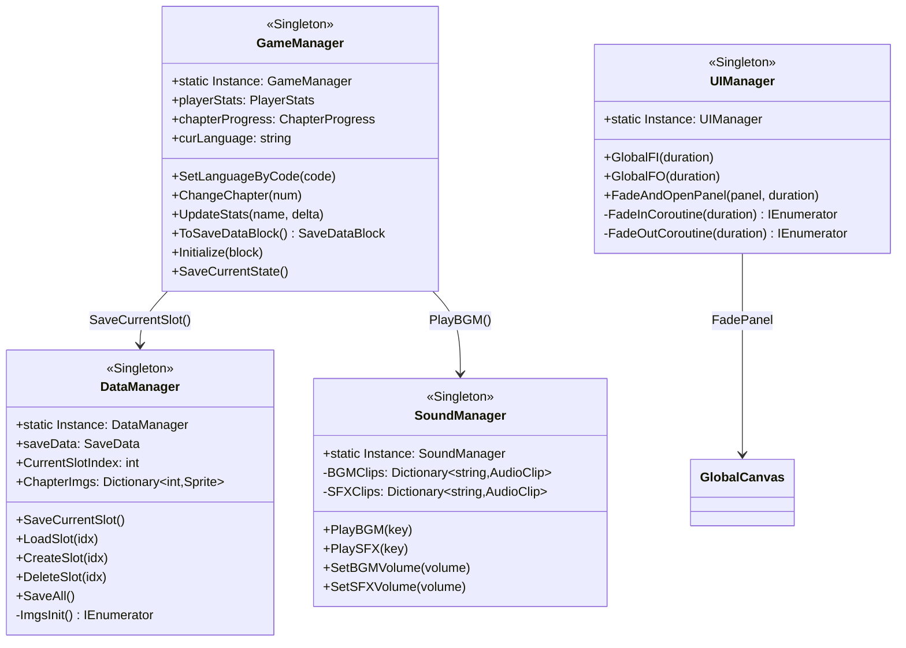
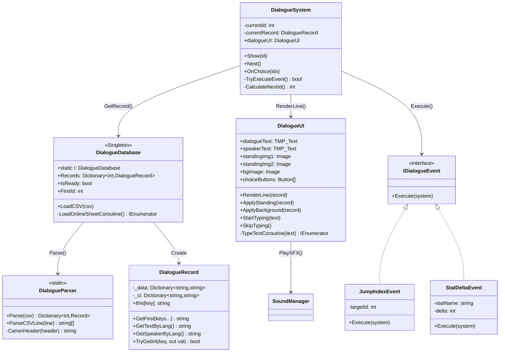
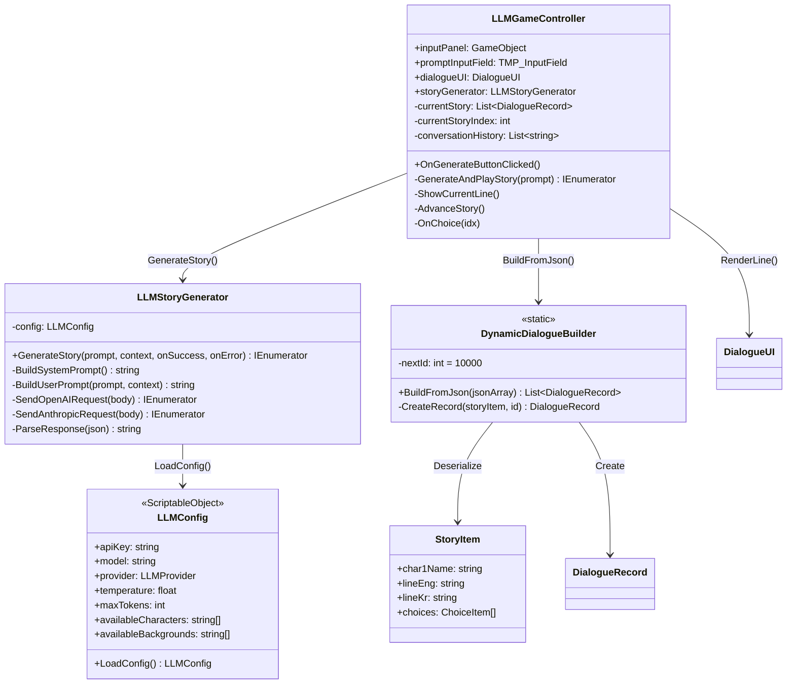
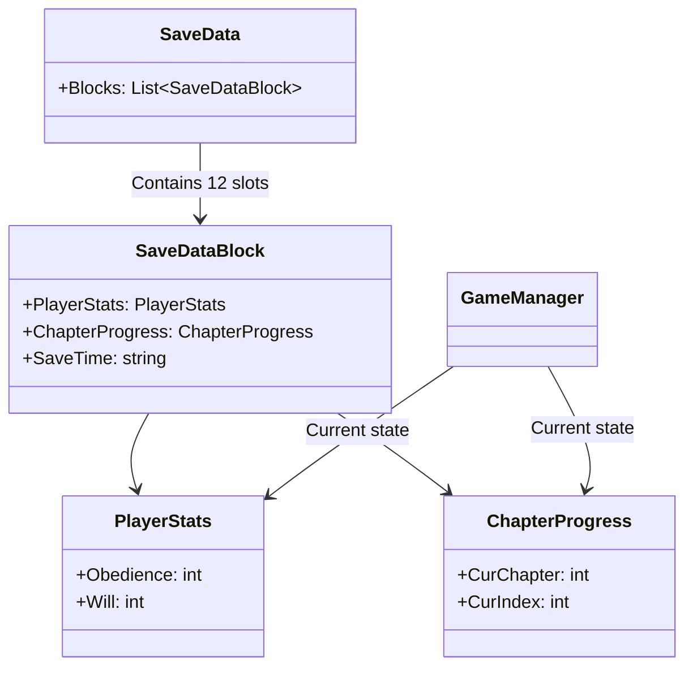
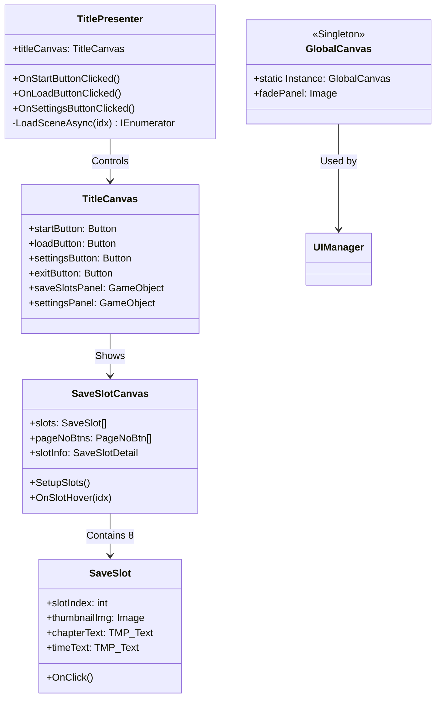

# Iyagi VN Toolkit - Technical Documentation

## 1. Overview

**Iyagi VN Toolkit**은 Unity 기반의 비주얼 노벨(Visual Novel) 프레임워크로, 전통적인 CSV 기반 대화 시스템과 LLM(Large Language Model) 기반 동적 스토리 생성을 모두 지원하는 하이브리드 엔진입니다.

### 주요 특징
- 📝 **CSV 기반 대화 시스템**: Google Sheets를 통한 협업 가능한 대화 스크립트 작성
- 🤖 **LLM 통합**: OpenAI GPT 및 Anthropic Claude를 활용한 실시간 스토리 생성
- 🌍 **다국어 지원**: Unity Localization을 통한 한국어/영어/일본어 지원
- 💾 **멀티 슬롯 세이브 시스템**: JSON 기반 12개 슬롯 저장/로드
- 🎨 **리소스 기반 UI**: Standing 이미지, 배경, 사운드 동적 로딩
- 🎯 **이벤트 시스템**: 확장 가능한 대화 이벤트 인터페이스

---

## 2. Project Structure

```
/Assets
├── /Editor                         # Unity Editor 확장 기능
│   └── LLMSetupMenus.cs           # LLM Scene 셋업 메뉴
├── /Localization                   # Unity Localization 데이터
│   └── String Tables               # 언어별 문자열 테이블
├── /Resources                      # 런타임 로드 가능 리소스
│   ├── /Image                     # 비주얼 리소스
│   │   ├── /BG                    # 배경 이미지
│   │   ├── /Standing              # 캐릭터 스탠딩 이미지
│   │   └── /Thumbnails            # 챕터 썸네일
│   ├── /Prefabs                   # UI/게임 오브젝트 프리팹
│   ├── /Scenario                  # CSV 대화 파일
│   │   └── testSheet.csv         # 샘플 대화 스크립트
│   ├── /Sound                     # 오디오 리소스
│   │   ├── /BGM                   # 배경음악
│   │   └── /SFX                   # 효과음
│   └── LLMConfig.asset            # LLM 설정 ScriptableObject
├── /Scenes                         # Unity Scene 파일
│   ├── 01_TitleScene.unity        # 타이틀/메인 메뉴
│   ├── 02_GameScene.unity         # CSV 기반 게임플레이
│   └── LLMGameScene.unity         # LLM 동적 스토리 생성
└── /Script                         # C# 소스코드
    ├── /0.Managers                # 싱글톤 매니저 클래스
    │   ├── GameManager.cs         # 게임 상태 관리
    │   ├── DataManager.cs         # 세이브/로드 시스템
    │   ├── DialogueManager.cs     # 대화 매니저 (Placeholder)
    │   ├── UIManager.cs           # 글로벌 UI 효과
    │   └── SoundManager.cs        # 오디오 재생
    ├── /1.UI                      # UI 컴포넌트
    │   ├── /TitleScene            # 타이틀 Scene UI
    │   │   ├── TitlePresenter.cs  # MVP 패턴 Presenter
    │   │   ├── TitleCanvas.cs     # 메인 메뉴 View
    │   │   ├── SaveSlotCanvas.cs  # 세이브 슬롯 브라우저
    │   │   └── SaveSlot.cs        # 개별 슬롯 UI
    │   ├── /GameScene             # 게임 Scene UI
    │   │   └── GlobalCanvas.cs    # 글로벌 페이드 패널
    │   └── /Dummy                 # 개발용 더미 UI
    ├── /2.DialogueSystem          # 대화 시스템
    │   ├── DialogueDatabase.cs    # 대화 데이터 저장소
    │   ├── DialogueParser.cs      # CSV 파싱
    │   ├── DialogueRecord.cs      # 대화 레코드 모델
    │   ├── DialogueSystem.cs      # 대화 플로우 컨트롤러
    │   ├── DialogueUI.cs          # 대화 렌더링
    │   ├── DialogueEvents.cs      # 이벤트 트리거 구현
    │   └── DialogueLoader.cs      # Google Sheets 다운로더
    └── /3.LLMSystem               # LLM 통합
        ├── LLMConfig.cs           # 설정 ScriptableObject
        ├── LLMStoryGenerator.cs   # LLM API 클라이언트
        ├── DynamicDialogueBuilder.cs  # JSON→DialogueRecord 변환
        └── LLMGameController.cs   # LLM 게임플레이 오케스트레이터
```

---

## 3. Core Systems

### 3.1 Manager Layer (Singleton Pattern)

#### GameManager
**역할**: 중앙 게임 상태 컨트롤러

```csharp
public class GameManager : MonoBehaviour
{
    public static GameManager Instance { get; private set; }

    public PlayerStats playerStats;          // 플레이어 스탯
    public ChapterProgress chapterProgress;  // 챕터 진행도
    public LocalizationSettings localizationSettings; // 다국어 설정
}
```

**주요 기능**:
- **다국어 관리**: `SetLanguageByCode(string langCode)` - Unity Localization 연동
- **챕터 관리**: `ChangeChapter(int chapterNum)` - 자동 저장 트리거
- **스탯 관리**: `UpdateStats(string statName, int delta)` - 플레이어 스탯 수정
- **세이브 연동**: `ToSaveDataBlock()` / `Initialize(SaveDataBlock)`

**초기화 순서**:
1. `Awake()`: 싱글톤 설정, DontDestroyOnLoad
2. `Start()`: Unity Localization 비동기 초기화
3. `Initialize()`: 세이브 데이터 로드 시 호출

---

#### DataManager
**역할**: 세이브/로드 시스템 오케스트레이터

```csharp
public class DataManager : MonoBehaviour
{
    public static DataManager Instance { get; private set; }

    public SaveData saveData;                    // 전체 세이브 데이터
    public int CurrentSlotIndex { get; set; }    // 현재 슬롯 인덱스
    public Dictionary<int, Sprite> ChapterImgs;  // 챕터 썸네일
}
```

**파일 구조**:
```json
{
  "Blocks": [
    {
      "PlayerStats": { "Obedience": 50, "Will": 30 },
      "ChapterProgress": { "CurChapter": 3, "CurIndex": 1205 },
      "SaveTime": "2025.10.31 14:30"
    },
    // ... 최대 12개 슬롯
  ]
}
```

**저장 경로**: `Application.persistentDataPath + "/iyagi_save.json"`

**주요 메서드**:
- `SaveCurrentSlot()`: 현재 GameManager 상태를 CurrentSlotIndex에 저장
- `LoadSlot(int idx)`: 특정 슬롯 로드 → GameManager.Initialize() 호출
- `CreateSlot(int idx)`: 새 슬롯 생성 (기본값)
- `DeleteSlot(int idx)`: 슬롯 삭제

**챕터 메타데이터**:
```csharp
// 12개 하드코딩된 챕터
ChapterInfos[1] = new ChapterInfo { ChapterName = "침묵과 저항의 밤" };
ChapterInfos[2] = new ChapterInfo { ChapterName = "이해할 수 없는 세계" };
// ...
```

---

#### UIManager
**역할**: 글로벌 UI 효과 (페이드 인/아웃)

```csharp
public class UIManager : MonoBehaviour
{
    public static UIManager Instance { get; private set; }

    public void GlobalFI(float duration);  // Fade In
    public void GlobalFO(float duration);  // Fade Out
    public IEnumerator FadeAndOpenPanel(GameObject panel, float duration);
}
```

**사용 예시**:
```csharp
// Scene 전환 시
UIManager.Instance.GlobalFO(1.0f);
await Task.Delay(1000);
SceneManager.LoadScene(1);
```

**Raycast Blocking**: 페이드 동안 입력 차단 (`Image.raycastTarget = true`)

---

#### SoundManager
**역할**: BGM/SFX 재생 및 볼륨 관리

```csharp
public class SoundManager : MonoBehaviour
{
    public static SoundManager Instance { get; private set; }

    public void PlayBGM(string key);           // 배경음악 재생
    public void PlaySFX(string key);           // 효과음 재생
    public void SetBGMVolume(float volume);    // 볼륨 설정 (0-1)
}
```

**볼륨 스케일링**:
```csharp
// 로그 스케일 적용 (AudioMixer)
float dbValue = Mathf.Log10(volume) * 20;
audioMixer.SetFloat("BGMVolume", dbValue);
```

**리소스 로딩**:
```csharp
// Resources/Sound/BGM/*.mp3
AudioClip clip = Resources.Load<AudioClip>($"Sound/BGM/{key}");
Dictionary<string, AudioClip> BGMClips; // 캐싱
```

---

### 3.2 Dialogue System (CSV-based)

#### Architecture Flow

```
┌─────────────────┐
│ Google Sheets   │ (Editor Only)
│ OR              │
│ Resources/CSV   │ (Runtime)
└────────┬────────┘
         │
         ↓ DialogueLoader / Resources.Load
┌─────────────────────────┐
│  DialogueDatabase       │
│  - LoadCSV()            │
│  - Hash Deduplication   │
└────────┬────────────────┘
         │
         ↓ DialogueParser.Parse()
┌─────────────────────────┐
│ Dictionary<int, Record> │
│ (ID-indexed lookup)     │
└────────┬────────────────┘
         │
         ↓ DialogueSystem.Show(id)
┌─────────────────────────┐
│     DialogueUI          │
│  - Render text          │
│  - Apply standing/BG    │
│  - Typing animation     │
└─────────────────────────┘
```

---

#### DialogueDatabase
**역할**: 대화 데이터 중앙 저장소

```csharp
public class DialogueDatabase : MonoBehaviour
{
    public static DialogueDatabase I { get; private set; }

    public Dictionary<int, DialogueRecord> Records;  // ID → Record
    public bool IsReady { get; private set; }        // 로딩 완료 플래그
    public int FirstId;                               // 시작 ID (자동 감지)
}
```

**로딩 전략**:
- **Editor Mode**: `useOnlineSheetInEditor` 설정 시 Google Sheets에서 다운로드
- **Runtime**: `Resources.Load<TextAsset>("dialogue")` (CSV)
- **중복 방지**: MD5 해시 비교로 변경사항 없으면 재파싱 스킵

**초기화**:
```csharp
void Start() {
    if (useOnlineSheetInEditor && Application.isEditor) {
        StartCoroutine(LoadOnlineSheetCoroutine());
    } else {
        LoadLocalCSV();
    }
}
```

---

#### DialogueParser
**역할**: CSV → DialogueRecord 변환

**지원 기능**:
- RFC 4180 호환 파싱 (따옴표 이스케이프, 개행 처리)
- BOM/NBSP 제거
- 헤더 정규화 (별칭 지원)

**헤더 별칭 예시**:
```csharp
// 다음은 모두 동일하게 인식됨
"Event Trigger" / "EventTrigger" / "이벤트트리거" → "EventTrigger"
"Param 1" / "Param1" / "매개변수1" → "Param1"
```

**파싱 프로세스**:
1. 줄 단위 분할 (`\r\n` / `\n`)
2. 헤더 행 탐지 (첫 비어있지 않은 줄)
3. 헤더 정규화 (`CanonHeader()`)
4. 데이터 행 파싱
5. ID 자동 할당 (없는 경우)

---

#### DialogueRecord
**역할**: 단일 대화 라인 데이터 컨테이너

```csharp
public class DialogueRecord
{
    Dictionary<string, string> _data;        // Raw CSV 데이터
    Dictionary<string, string> _ci;          // Case-insensitive 인덱스

    public string this[string key] { get; }  // 인덱서
    public string GetFirst(params string[] keys);  // 폴백 지원
}
```

**주요 필드** (CSV 컬럼):
| 컬럼 | 설명 | 예시 |
|------|------|------|
| `ID` | 고유 식별자 | 1001 |
| `Line_ENG` / `Line_KOR` | 대사 텍스트 | "Hello, Hans." |
| `Char1Name` / `Char2Name` | 캐릭터 이름 | "Hans", "Heilner" |
| `Char1Look` / `Char2Look` | 표정/룩 | "Normal_Normal" |
| `Background` | 배경 이미지 | "Classroom" |
| `C1_ENG` / `C2_ENG` / `C3_ENG` | 선택지 텍스트 | "Agree", "Refuse" |
| `Next1` / `Next2` / `Next3` | 선택지 다음 ID | 1005, 1010 |
| `EventTrigger` | 이벤트 트리거 | "JumpIndex", "StatInc" |
| `Param1` / `Param2` | 이벤트 매개변수 | "Obedience", "10" |

**다국어 헬퍼 메서드**:
```csharp
public string GetTextByLang() {
    switch (GameManager.Instance.curLanguage) {
        case "ko": return GetFirst("Line_KOR", "ParsedLine_KOR");
        case "en": return GetFirst("Line_ENG", "ParsedLine_ENG");
        // ...
    }
}

public string GetSpeakerByLang() {
    string rawName = GetFirst("Char1Name", "캐릭터1이름");
    // 하드코딩된 매핑
    if (rawName == "Hans") return Localization.GetString("Speaker_Hans");
    // ...
}
```

---

#### DialogueSystem
**역할**: 게임플레이 대화 플로우 컨트롤러

```csharp
public class DialogueSystem : MonoBehaviour
{
    private int currentId;
    private DialogueRecord currentRecord;

    public void Show(int id);         // 대화 라인 표시
    public void Next();               // 다음 라인으로 진행
    public void OnChoice(int idx);    // 선택지 선택
}
```

**입력 처리**:
```csharp
void Update() {
    if (Input.GetKeyDown(KeyCode.Space) || Input.GetKeyDown(KeyCode.Return)) {
        if (dialogueUI.IsTyping) {
            dialogueUI.SkipTyping();  // 타이핑 스킵
        } else {
            Next();  // 다음 라인
        }
    }

    // 선택지 단축키
    if (Input.GetKeyDown(KeyCode.Alpha1)) OnChoice(1);
    if (Input.GetKeyDown(KeyCode.Alpha2)) OnChoice(2);
    if (Input.GetKeyDown(KeyCode.Alpha3)) OnChoice(3);
}
```

**플로우 로직**:
```
Show(id)
  ↓
Load DialogueRecord
  ↓
Apply Standing/BG
  ↓
Play SFX
  ↓
Typing Animation
  ↓
OnLineFinishedTyping()
  ↓
Check EventTrigger ─→ Execute Event ─→ (가능: Show 재호출)
  ↓
Show Choices (if any)
  ↓
Wait for Input (Space or Choice)
  ↓
Next() or OnChoice(idx)
  ↓
Calculate NextId ─→ Show(NextId)
```

**NextId 계산**:
```csharp
int CalculateNextId() {
    if (currentRecord.TryGetInt("NextIndex1", out int next)) {
        return next;  // 명시적 NextIndex1
    }
    return currentId + 1;  // 기본: 순차 진행
}

void OnChoice(int idx) {
    string nextKey = $"Next{idx}";
    if (currentRecord.TryGetInt(nextKey, out int nextId)) {
        Show(nextId);
    }
}
```

---

#### DialogueUI
**역할**: 비주얼 렌더링

```csharp
public class DialogueUI : MonoBehaviour
{
    [Header("Text")]
    public TMP_Text dialogueText;
    public TMP_Text speakerText;

    [Header("Images")]
    public Image standingImg1;
    public Image standingImg2;
    public Image bgImage;

    [Header("Choices")]
    public Button[] choiceButtons;

    public float typingSpeed = 0.05f;
}
```

**Standing 시스템**:
```csharp
// Position Presets (Inspector 설정)
[Header("Standing Positions")]
public Vector3 leftPos = new(-400, 0, 0);
public Vector3 centerPos = new(0, 0, 0);
public Vector3 rightPos = new(400, 0, 0);

// Scale Presets
public float smallScale = 0.8f;
public float mediumScale = 1.0f;
public float largeScale = 1.2f;

// Resource Path
string path = $"Image/Standing/{charName}_{look}";
Sprite sprite = Resources.Load<Sprite>(path);
```

**캐릭터 배치 로직**:
```csharp
// 1명: 중앙
if (char2Name.IsNullOrEmpty()) {
    standingImg1.transform.position = centerPos;
}
// 2명: 좌우
else {
    standingImg1.transform.position = leftPos;
    standingImg2.transform.position = rightPos;
}

// CSV "Pos" 컬럼으로 오버라이드 가능
if (record.GetFirst("Pos") == "1=Center") {
    standingImg1.transform.position = centerPos;
}
```

**타이핑 애니메이션**:
```csharp
IEnumerator TypeText(string text) {
    dialogueText.text = "";
    foreach (char c in text) {
        dialogueText.text += c;
        yield return new WaitForSeconds(typingSpeed);
    }
    isTyping = false;
}
```

---

#### DialogueEvents
**역할**: 이벤트 트리거 구현

**인터페이스**:
```csharp
public interface IDialogueEvent
{
    void Execute(DialogueSystem system);
}
```

**구현된 이벤트**:

1. **JumpIndexEvent** - 특정 ID로 점프
```csharp
public class JumpIndexEvent : IDialogueEvent
{
    int targetId;
    public void Execute(DialogueSystem sys) {
        sys.Show(targetId);
    }
}
```

2. **StatDeltaEvent** - 스탯 수정
```csharp
public class StatDeltaEvent : IDialogueEvent
{
    string statName;  // "Obedience", "Will"
    int delta;        // +10, -5

    public void Execute(DialogueSystem sys) {
        // Reflection으로 PlayerStats 필드 수정
        FieldInfo field = typeof(PlayerStats).GetField(statName);
        int curVal = (int)field.GetValue(GameManager.Instance.playerStats);
        field.SetValue(..., curVal + delta);
        GameManager.Instance.SaveCurrentState();
    }
}
```

3. **ChangeBGMEvent** - 배경음악 변경
```csharp
public class ChangeBGMEvent : IDialogueEvent
{
    string bgmKey;
    public void Execute(DialogueSystem sys) {
        SoundManager.Instance.PlayBGM(bgmKey);
    }
}
```

**CSV에서 사용**:
| EventTrigger | Param1 | Param2 | 설명 |
|--------------|--------|--------|------|
| `JumpIndex` | `1500` | | ID 1500으로 점프 |
| `StatInc` | `Obedience` | `10` | 복종도 +10 |
| `StatDec` | `Will` | `5` | 의지 -5 |
| `ChangeBGM` | `Forest_Theme` | | BGM 변경 |

---

### 3.3 LLM System (Dynamic Story Generation)

#### Architecture Flow

```
┌─────────────────┐
│  User Prompt    │
│  "Tell a story  │
│  about Hans"    │
└────────┬────────┘
         │
         ↓
┌──────────────────────────┐
│  LLMStoryGenerator       │
│  ┌────────────────────┐  │
│  │ System Prompt:     │  │
│  │ - Available chars  │  │
│  │ - Output schema    │  │
│  │ - JSON example     │  │
│  └────────────────────┘  │
│  ┌────────────────────┐  │
│  │ User Prompt:       │  │
│  │ - Current request  │  │
│  │ - Context history  │  │
│  └────────────────────┘  │
│                          │
│  POST /v1/chat/completions │ (OpenAI)
│  POST /v1/messages         │ (Anthropic)
└────────┬─────────────────┘
         │
         ↓ JSON Response
┌──────────────────────────┐
│ [{                       │
│   "char1Name": "Hans",   │
│   "lineEng": "...",      │
│   "lineKr": "...",       │
│   "choices": [...]       │
│ }, ...]                  │
└────────┬─────────────────┘
         │
         ↓ DynamicDialogueBuilder
┌──────────────────────────┐
│ List<DialogueRecord>     │
│ - ID: 10000+             │
│ - Next: Auto-chained     │
└────────┬─────────────────┘
         │
         ↓
┌──────────────────────────┐
│  LLMGameController       │
│  - currentStory list     │
│  - Sequential playback   │
└────────┬─────────────────┘
         │
         ↓
┌──────────────────────────┐
│      DialogueUI          │
│  (Reused from CSV mode)  │
└──────────────────────────┘
```

---

#### LLMConfig (ScriptableObject)
**역할**: LLM 설정 중앙화

```csharp
[CreateAssetMenu(fileName = "LLMConfig", menuName = "LLM/Config")]
public class LLMConfig : ScriptableObject
{
    [Header("API Settings")]
    public string apiKey;
    public string model = "gpt-4";
    public LLMProvider provider = LLMProvider.OpenAI;

    [Header("Generation")]
    public float temperature = 0.7f;
    public int maxTokens = 2000;

    [Header("Resource Constraints")]
    public string[] availableCharacters = { "Hans", "Heilner", "Principal" };
    public string[] availableBackgrounds = { "Classroom", "Dorm", "Forest" };
    public string[] availableLooks = { "Normal_Normal", "Happy_Smile", "Sad_Frown" };
}
```

**로딩**:
```csharp
public static LLMConfig LoadConfig() {
    return Resources.Load<LLMConfig>("LLMConfig");
}
```

**보안**: `.gitignore`에 `LLMConfig.asset` 추가 권장 (API 키 보호)

---

#### LLMStoryGenerator
**역할**: LLM API 클라이언트

```csharp
public class LLMStoryGenerator : MonoBehaviour
{
    public IEnumerator GenerateStory(
        string userPrompt,
        List<string> contextHistory,
        System.Action<string> onSuccess,
        System.Action<string> onError
    )
}
```

**System Prompt 구조**:
```plaintext
You are a visual novel story generator. Generate a story as a JSON array.

Available Resources:
- Characters: Hans, Heilner, Principal
- Backgrounds: Classroom, Dorm, Forest
- Looks: Normal_Normal, Happy_Smile, Sad_Frown

Output Format:
[
  {
    "char1Name": "Hans",
    "char1Look": "Normal_Normal",
    "char2Name": "",
    "char2Look": "",
    "background": "Classroom",
    "lineEng": "Dialogue in English.",
    "lineKr": "한국어 대사.",
    "choices": [
      {"textEng": "Choice 1", "textKr": "선택지 1"},
      ...
    ]
  },
  ...
]

Constraints:
- Use only the available resources
- Generate 5-10 dialogue lines
- Add choices at decision points
```

**Context History 예시**:
```plaintext
Previous interactions:
User: Tell a story about Hans in the classroom
Assistant: [Generated 5 lines about Hans studying]
User: He hears a knock on the door
```

**API 요청**:

**OpenAI**:
```csharp
var requestBody = new {
    model = config.model,
    messages = new[] {
        new { role = "system", content = systemPrompt },
        new { role = "user", content = userPrompt }
    },
    temperature = config.temperature,
    max_tokens = config.maxTokens
};

UnityWebRequest request = new(
    "https://api.openai.com/v1/chat/completions",
    "POST"
);
request.SetRequestHeader("Authorization", $"Bearer {config.apiKey}");
request.SetRequestHeader("Content-Type", "application/json");
```

**Anthropic**:
```csharp
var requestBody = new {
    model = "claude-3-sonnet-20240229",
    system = systemPrompt,
    messages = new[] {
        new { role = "user", content = userPrompt }
    },
    temperature = config.temperature,
    max_tokens = config.maxTokens
};

UnityWebRequest request = new(
    "https://api.anthropic.com/v1/messages",
    "POST"
);
request.SetRequestHeader("x-api-key", config.apiKey);
request.SetRequestHeader("anthropic-version", "2023-06-01");
```

**응답 파싱**:
```csharp
// OpenAI
var response = JsonUtility.FromJson<OpenAIResponse>(json);
string content = response.choices[0].message.content;

// Anthropic
var response = JsonUtility.FromJson<AnthropicResponse>(json);
string content = response.content[0].text;

// Extract JSON array
int start = content.IndexOf('[');
int end = content.LastIndexOf(']') + 1;
string jsonArray = content.Substring(start, end - start);
```

---

#### DynamicDialogueBuilder
**역할**: JSON → DialogueRecord 변환

```csharp
public static class DynamicDialogueBuilder
{
    private static int nextId = 10000;  // CSV ID와 충돌 방지

    public static List<DialogueRecord> BuildFromJson(string jsonArray)
    {
        var storyItems = JsonUtility.FromJson<StoryItemArray>(
            "{\"items\":" + jsonArray + "}"
        );

        List<DialogueRecord> records = new();

        for (int i = 0; i < storyItems.items.Length; i++) {
            var item = storyItems.items[i];
            var record = new DialogueRecord();

            // ID 할당
            record["ID"] = nextId.ToString();

            // 텍스트 필드
            record["Line_ENG"] = item.lineEng;
            record["Line_KOR"] = item.lineKr;
            record["ParsedLine_ENG"] = item.lineEng;
            record["ParsedLine_KOR"] = item.lineKr;

            // 캐릭터
            record["Char1Name"] = item.char1Name;
            record["Char1Look"] = item.char1Look ?? "Normal_Normal";
            record["Char2Name"] = item.char2Name ?? "";
            record["Char2Look"] = item.char2Look ?? "";

            // 배경
            record["Background"] = item.background ?? "";

            // 선택지
            for (int j = 0; j < item.choices?.Length; j++) {
                record[$"C{j+1}_ENG"] = item.choices[j].textEng;
                record[$"C{j+1}_KOR"] = item.choices[j].textKr;
                record[$"Choice{j+1}ENG"] = item.choices[j].textEng;
                record[$"Choice{j+1}KOR"] = item.choices[j].textKr;
            }

            // Next 체이닝
            if (i < storyItems.items.Length - 1) {
                record["NextIndex1"] = (nextId + 1).ToString();
            }

            records.Add(record);
            nextId++;
        }

        return records;
    }
}
```

**JSON 스키마**:
```csharp
[System.Serializable]
public class StoryItem
{
    public string char1Name;
    public string char1Look;
    public string char2Name;
    public string char2Look;
    public string background;
    public string lineEng;
    public string lineKr;
    public ChoiceItem[] choices;
}

[System.Serializable]
public class ChoiceItem
{
    public string textEng;
    public string textKr;
}
```

---

#### LLMGameController
**역할**: LLM 게임플레이 오케스트레이터

```csharp
public class LLMGameController : MonoBehaviour
{
    [Header("UI References")]
    public GameObject inputPanel;
    public TMP_InputField promptInputField;
    public Button generateButton;
    public TMP_Text statusText;
    public DialogueUI dialogueUI;

    [Header("LLM")]
    public LLMStoryGenerator storyGenerator;

    [Header("State")]
    private List<DialogueRecord> currentStory;
    private int currentStoryIndex;
    private bool isGenerating;
    private bool isPlaying;

    [Header("Context")]
    public int contextHistoryCount = 5;
    private List<string> conversationHistory;
}
```

**게임 플로우**:

1. **사용자 입력**:
```csharp
public void OnGenerateButtonClicked()
{
    if (isGenerating) return;

    string prompt = promptInputField.text;
    if (string.IsNullOrEmpty(prompt)) {
        statusText.text = "Please enter a prompt!";
        return;
    }

    StartCoroutine(GenerateAndPlayStory(prompt));
}
```

2. **스토리 생성**:
```csharp
IEnumerator GenerateAndPlayStory(string userPrompt)
{
    isGenerating = true;
    statusText.text = "Generating story...";

    // Add to history
    conversationHistory.Add($"User: {userPrompt}");

    // Call LLM
    yield return storyGenerator.GenerateStory(
        userPrompt,
        conversationHistory,
        OnStoryGenerated,
        OnGenerationError
    );
}
```

3. **재생**:
```csharp
void OnStoryGenerated(string jsonArray)
{
    isGenerating = false;

    // Parse
    currentStory = DynamicDialogueBuilder.BuildFromJson(jsonArray);

    // Add to history
    conversationHistory.Add($"Assistant: {jsonArray}");
    if (conversationHistory.Count > contextHistoryCount * 2) {
        conversationHistory.RemoveAt(0);
    }

    // Play
    currentStoryIndex = 0;
    ShowCurrentLine();

    inputPanel.SetActive(false);
    isPlaying = true;
}

void ShowCurrentLine()
{
    var record = currentStory[currentStoryIndex];

    // Render via DialogueUI (same as CSV mode)
    dialogueUI.RenderLine(record);

    // Apply standing/BG
    dialogueUI.ApplyStanding(record);
    dialogueUI.ApplyBackground(record);

    // Start typing
    dialogueUI.StartTyping(record.GetTextByLang());
}
```

4. **입력 처리**:
```csharp
void Update()
{
    if (!isPlaying) return;

    if (Input.GetKeyDown(KeyCode.Space) || Input.GetKeyDown(KeyCode.Return)) {
        if (dialogueUI.IsTyping) {
            dialogueUI.SkipTyping();
        } else {
            AdvanceStory();
        }
    }

    // Choice keys
    if (Input.GetKeyDown(KeyCode.Alpha1)) OnChoice(1);
    if (Input.GetKeyDown(KeyCode.Alpha2)) OnChoice(2);
    if (Input.GetKeyDown(KeyCode.Alpha3)) OnChoice(3);
}

void AdvanceStory()
{
    currentStoryIndex++;

    if (currentStoryIndex >= currentStory.Count) {
        // Story finished
        isPlaying = false;
        inputPanel.SetActive(true);
        statusText.text = "Story finished. Enter new prompt to continue.";
    } else {
        ShowCurrentLine();
    }
}
```

---

### 3.4 Save/Load System

#### Data Models

```csharp
[System.Serializable]
public class PlayerStats
{
    public int Obedience;  // 복종도
    public int Will;       // 의지
}

[System.Serializable]
public class ChapterProgress
{
    public int CurChapter;  // 1-12
    public int CurIndex;    // Dialogue ID
}

[System.Serializable]
public class SaveDataBlock
{
    public PlayerStats PlayerStats;
    public ChapterProgress ChapterProgress;
    public string SaveTime;  // "yyyy.MM.dd HH:mm"
}

[System.Serializable]
public class SaveData
{
    public List<SaveDataBlock> Blocks;  // 최대 12개 슬롯
}
```

#### Save Flow

```
User Action (Chapter Change / Stat Update / Exit)
  ↓
GameManager.SaveCurrentState()
  ↓
GameManager.ToSaveDataBlock()
  ↓
┌─────────────────────────┐
│ Create SaveDataBlock    │
│ - Copy PlayerStats      │
│ - Copy ChapterProgress  │
│ - Set SaveTime          │
└────────┬────────────────┘
         │
         ↓
DataManager.SaveCurrentSlot()
  ↓
DataManager.saveData.Blocks[CurrentSlotIndex] = block
  ↓
DataManager.SaveAll()
  ↓
JsonUtility.ToJson(saveData)
  ↓
File.WriteAllText(savePath, json)
```

#### Load Flow

```
TitleScene - User clicks Load Slot
  ↓
DataManager.LoadSlot(index)
  ↓
GameManager.Instance.Initialize(saveData.Blocks[index])
  ↓
┌─────────────────────────┐
│ Copy to GameManager     │
│ - playerStats = ...     │
│ - chapterProgress = ... │
└────────┬────────────────┘
         │
         ↓
UIManager.GlobalFadeOut()
  ↓
SceneManager.LoadScene("02_GameScene")
  ↓
DialogueSystem.Start()
  ↓
Show(chapterProgress.CurIndex)
```

---

## 4. Scene Flow

```
┌──────────────────────┐
│  01_TitleScene       │
│  ┌────────────────┐  │
│  │ TitleCanvas    │  │
│  │ - Start        │◄─┐
│  │ - Load         │  │
│  │ - Settings     │  │
│  │ - Exit         │  │
│  └────────────────┘  │
│                      │
│  [Managers Init]     │
│  - GameManager       │
│  - DataManager       │
│  - SoundManager      │
│  - UIManager         │
│  - DialogueDatabase  │
│  [DontDestroyOnLoad] │
└──────┬───────────────┘
       │
       │ [Start Button]
       ↓
┌──────────────────────┐
│  02_GameScene        │
│  ┌────────────────┐  │
│  │ DialogueSystem │  │
│  │ DialogueUI     │  │
│  │ Canvas         │  │
│  │ - Standing     │  │
│  │ - BG           │  │
│  │ - Choices      │  │
│  └────────────────┘  │
│                      │
│  [CSV Dialogue]      │
│  Linear/Branching    │
│  Event Triggers      │
│  Auto-save           │
└──────┬───────────────┘
       │
       │ [Menu → Title]
       ↑
       │
┌──────────────────────┐
│  LLMGameScene        │
│  ┌────────────────┐  │
│  │ LLMGameCtrl    │  │
│  │ DialogueUI     │  │
│  │ InputPanel     │  │
│  │ - Prompt Field │  │
│  │ - Generate Btn │  │
│  └────────────────┘  │
│                      │
│  [Dynamic Story]     │
│  LLM Generation      │
│  Context History     │
│  No Auto-save        │
└──────────────────────┘
```

---

## 5. Class Diagram

### 5.1 Manager Layer



### 5.2 Dialogue System



### 5.3 LLM System



### 5.4 Data Models



### 5.5 UI Layer



---

## 6. Game Flow

### 6.1 CSV Mode Flow

```
[App Start]
  ↓
01_TitleScene Loads
  ↓
Managers Initialize (Awake)
  ├─ GameManager: DontDestroyOnLoad, Localization Init
  ├─ DataManager: Load save file (iyagi_save.json)
  ├─ SoundManager: Load audio clips
  └─ UIManager: Setup fade panel
  ↓
DialogueDatabase.LoadCSV()
  ├─ Editor + useOnlineSheet: DialogueLoader.LoadCSV()
  └─ Runtime: Resources.Load("dialogue")
  ↓
DialogueParser.Parse(csv)
  ↓
Dictionary<int, DialogueRecord> populated
  ↓
[User: Click Start Button]
  ↓
TitlePresenter.OnStartButtonClicked()
  ↓
DataManager.LoadSlot(lastUsedSlot)
  ↓
GameManager.Initialize(saveDataBlock)
  ├─ playerStats = block.PlayerStats
  └─ chapterProgress = block.ChapterProgress
  ↓
UIManager.GlobalFO(1.0f)
  ↓
SceneManager.LoadScene(1) // 02_GameScene
  ↓
[02_GameScene Loaded]
  ↓
DialogueSystem.Start()
  ↓
Show(chapterProgress.CurIndex)
  ↓
┌────────────────────────────┐
│  Dialogue Loop             │
│  ┌──────────────────────┐  │
│  │ Load Record by ID    │  │
│  │ ↓                    │  │
│  │ Apply Standing/BG    │  │
│  │ ↓                    │  │
│  │ Play SFX             │  │
│  │ ↓                    │  │
│  │ Typing Animation     │  │
│  │ ↓                    │  │
│  │ Check EventTrigger   │──┼─→ Execute Event
│  │ ↓                    │  │   (StatInc/JumpIndex/etc.)
│  │ Show Choices         │  │
│  │ ↓                    │  │
│  │ Wait Input           │  │
│  │ ├─ Space: Next()     │  │
│  │ └─ 1/2/3: OnChoice() │  │
│  │ ↓                    │  │
│  │ Calculate NextId     │  │
│  │ ↓                    │  │
│  │ Show(NextId)         │──┘
│  └──────────────────────┘
└────────────────────────────┘
  ↓ (On Chapter Change)
GameManager.ChangeChapter(newChapter)
  ↓
DataManager.SaveCurrentSlot()
  ↓
File.WriteAllText(savePath, json)
```

### 6.2 LLM Mode Flow

```
[User: Access LLMGameScene]
  ↓
LLMGameController.Start()
  ├─ Load LLMConfig
  ├─ Setup UI (InputPanel visible)
  └─ Initialize conversationHistory
  ↓
[User: Enter Prompt]
  ↓
OnGenerateButtonClicked()
  ↓
GenerateAndPlayStory(userPrompt)
  ↓
LLMStoryGenerator.GenerateStory()
  ├─ Build System Prompt
  │   ├─ Available resources (chars/BGs/looks)
  │   └─ Output schema + example
  ├─ Build User Prompt
  │   ├─ Current request
  │   └─ Context history (last 5 turns)
  ├─ Create UnityWebRequest
  │   ├─ OpenAI: POST /v1/chat/completions
  │   └─ Anthropic: POST /v1/messages
  └─ Send Request
  ↓
[API Response]
  ↓
Parse JSON Response
  ├─ Extract content/text field
  └─ Find [...] array bounds
  ↓
DynamicDialogueBuilder.BuildFromJson()
  ├─ Deserialize StoryItem[]
  ├─ Create DialogueRecords (ID 10000+)
  ├─ Map fields (lineEng→Line_ENG, etc.)
  └─ Chain Next fields
  ↓
LLMGameController.OnStoryGenerated()
  ├─ Store currentStory
  ├─ Add to conversationHistory
  ├─ Hide InputPanel
  └─ Show first line
  ↓
┌────────────────────────────┐
│  Playback Loop             │
│  ┌──────────────────────┐  │
│  │ ShowCurrentLine()    │  │
│  │ ↓                    │  │
│  │ DialogueUI.Render()  │  │
│  │ ↓                    │  │
│  │ Typing Animation     │  │
│  │ ↓                    │  │
│  │ Wait Input           │  │
│  │ ├─ Space: Advance    │  │
│  │ └─ 1/2/3: OnChoice() │  │
│  │ ↓                    │  │
│  │ currentStoryIndex++  │  │
│  │ ↓                    │  │
│  │ If < story.Count:    │  │
│  │   ShowCurrentLine()  │──┘
│  │ Else:                │
│  │   Story Finished     │
│  └──────────────────────┘
└────────────────────────────┘
  ↓
Show InputPanel
  ↓
[User: New Prompt (with context)]
  ↓
Repeat from GenerateAndPlayStory()
```

---

## 7. Key Technical Features

### 7.1 CSV Parsing
- **RFC 4180 Compliant**: 따옴표 이스케이프, 개행 처리
- **BOM/NBSP 제거**: UTF-8 BOM, Non-Breaking Space 자동 제거
- **헤더 정규화**: 다양한 컬럼명 별칭 지원 (한/영, 공백/언더스코어)
- **대소문자 무시**: Dictionary의 케이스 인센시티브 인덱스 (`_ci`)

### 7.2 Resource Loading
```csharp
// Standing Images
Resources.Load<Sprite>($"Image/Standing/{charName}_{look}");
// 예: "Image/Standing/Hans_Normal_Normal"

// Backgrounds
Resources.Load<Sprite>($"Image/BG/{bgName}");

// Audio
Resources.Load<AudioClip>($"Sound/BGM/{key}");
Resources.Load<AudioClip>($"Sound/SFX/{key}");
```

**최적화**: Dictionary 캐싱으로 중복 로드 방지

### 7.3 Localization
```csharp
// Unity Localization Package 사용
using UnityEngine.Localization;
using UnityEngine.Localization.Settings;

LocalizationSettings.SelectedLocale =
    LocalizationSettings.AvailableLocales.GetLocale("ko");

// String Table 참조
string localizedText = LocalizationSettings.StringDatabase
    .GetLocalizedString("UI", "StartButton");
```

**지원 언어**: 한국어(ko), 영어(en), 일본어(ja)

### 7.4 Coroutine-based Animation
```csharp
// Typing Effect
IEnumerator TypeTextCoroutine(string text) {
    dialogueText.text = "";
    foreach (char c in text) {
        dialogueText.text += c;
        yield return new WaitForSeconds(typingSpeed);
    }
}

// Fade Effect
IEnumerator FadeInCoroutine(float duration) {
    float elapsed = 0f;
    while (elapsed < duration) {
        elapsed += Time.deltaTime;
        float alpha = Mathf.Lerp(1, 0, elapsed / duration);
        fadePanel.color = new Color(0, 0, 0, alpha);
        yield return null;
    }
}
```

### 7.5 Event System Extensibility
```csharp
// 새 이벤트 추가 방법
public class CustomEvent : IDialogueEvent
{
    public void Execute(DialogueSystem system) {
        // Custom logic
        Debug.Log("Custom event triggered!");
    }
}

// CSV에서 사용
// EventTrigger: CustomEvent
// Param1: param_value
```

### 7.6 LLM Provider Abstraction
```csharp
public enum LLMProvider { OpenAI, Anthropic }

// Provider별 요청 분기
if (config.provider == LLMProvider.OpenAI) {
    yield return SendOpenAIRequest(userPrompt);
} else {
    yield return SendAnthropicRequest(userPrompt);
}
```

**확장 가능**: 새 Provider 추가 시 `SendXXXRequest()` 메서드 구현

---

## 8. Development Workflow

### 8.1 Adding Dialogue Content (CSV Mode)

1. **Google Sheets 편집**:
   ```
   https://docs.google.com/spreadsheets/d/{SHEET_ID}/edit
   ```
   - 컬럼: ID, Line_ENG, Line_KOR, Char1Name, Background, etc.
   - 선택지: C1_ENG, C2_ENG, Next1, Next2

2. **Unity Editor에서 테스트**:
   - DialogueDatabase Inspector에서 `useOnlineSheetInEditor` 체크
   - `sheetURL` 설정 (Google Sheets CSV export URL)
   - Play 시 자동 다운로드

3. **빌드용 CSV 생성**:
   - Google Sheets → File → Download → CSV
   - `Assets/Resources/Scenario/dialogue.csv`로 저장

### 8.2 Adding LLM Story Prompts

1. **LLMConfig 설정**:
   ```
   Assets/Resources/LLMConfig.asset
   - API Key 입력
   - Model 선택 (gpt-4, claude-3-sonnet 등)
   - Temperature/MaxTokens 조정
   ```

2. **리소스 제약 설정**:
   ```csharp
   availableCharacters: ["Hans", "Heilner", "Principal"]
   availableBackgrounds: ["Classroom", "Dorm", "Forest"]
   availableLooks: ["Normal_Normal", "Happy_Smile"]
   ```

3. **Scene에서 테스트**:
   - LLMGameScene 열기
   - Play → 프롬프트 입력
   - 생성된 스토리 확인

### 8.3 Adding New Characters

1. **Standing 이미지 추가**:
   ```
   Assets/Resources/Image/Standing/
   └─ NewCharacter_Normal_Normal.png
   └─ NewCharacter_Happy_Smile.png
   ```

2. **CSV에 추가**:
   ```
   Char1Name: NewCharacter
   Char1Look: Normal_Normal
   ```

3. **Localization 업데이트**:
   ```
   String Table "Speakers"
   - Speaker_NewCharacter: "새 캐릭터"
   ```

4. **DialogueRecord 수정 (Optional)**:
   ```csharp
   // GetSpeakerByLang()에 하드코딩된 매핑 추가
   if (rawName == "NewCharacter")
       return Localization.GetString("Speaker_NewCharacter");
   ```

### 8.4 Adding New Events

1. **이벤트 클래스 작성**:
   ```csharp
   public class MyCustomEvent : IDialogueEvent
   {
       public string param1;
       public string param2;

       public void Execute(DialogueSystem system) {
           // Custom logic
           Debug.Log($"MyCustomEvent: {param1}, {param2}");
       }
   }
   ```

2. **DialogueSystem 등록**:
   ```csharp
   bool TryExecuteEvent() {
       string trigger = currentRecord.GetFirst("EventTrigger");
       if (trigger == "MyCustomEvent") {
           var evt = new MyCustomEvent {
               param1 = currentRecord.GetFirst("Param1"),
               param2 = currentRecord.GetFirst("Param2")
           };
           evt.Execute(this);
           return true;
       }
       // ...
   }
   ```

3. **CSV에서 사용**:
   ```
   EventTrigger: MyCustomEvent
   Param1: value1
   Param2: value2
   ```

---

## 9. Testing & Debugging

### 9.1 Dialogue System Testing

**Debugging Tools**:
```csharp
// DialogueSystem.cs
void Update() {
    if (Input.GetKeyDown(KeyCode.F1)) {
        Debug.Log($"Current ID: {currentId}");
        Debug.Log($"Record Keys: {string.Join(", ", currentRecord._data.Keys)}");
    }
}
```

**Test Cases**:
1. **선형 진행**: ID 1001 → 1002 → 1003
2. **선택지 분기**: ID 1005 → Choice 1 → 1010 / Choice 2 → 1020
3. **이벤트 트리거**: StatInc → 스탯 변경 확인
4. **Standing 전환**: Char1Look 변경 → 이미지 갱신 확인

### 9.2 LLM System Testing

**Mock Responses**:
```csharp
// LLMStoryGenerator.cs (Editor Only)
#if UNITY_EDITOR
if (useMockResponse) {
    string mockJson = @"[
        {""char1Name"": ""Hans"", ""lineEng"": ""Test line"", ...}
    ]";
    onSuccess?.Invoke(mockJson);
    yield break;
}
#endif
```

**Test Scenarios**:
1. **API 오류 처리**: Invalid API Key → Error 메시지 확인
2. **JSON 파싱 실패**: Malformed JSON → Fallback 동작
3. **Context History**: 5턴 대화 → 히스토리 유지 확인
4. **Resource Constraints**: LLM이 사용 불가능한 캐릭터 생성 시 처리

### 9.3 Save/Load Testing

**Test Procedure**:
1. 새 슬롯 생성 → 저장
2. 스탯 변경 → 저장
3. 게임 재시작 → 로드
4. 스탯 값 검증

**JSON 검증**:
```bash
# macOS/Linux
cat ~/Library/Application\ Support/YourCompany/Iyagi/iyagi_save.json | jq .

# Windows
type %APPDATA%\..\LocalLow\YourCompany\Iyagi\iyagi_save.json
```

---

## 10. Performance Optimization

### 10.1 Resource Caching
```csharp
// SoundManager.cs
Dictionary<string, AudioClip> BGMClips = new();

public void PlayBGM(string key) {
    if (!BGMClips.ContainsKey(key)) {
        BGMClips[key] = Resources.Load<AudioClip>($"Sound/BGM/{key}");
    }
    BGMAudio.clip = BGMClips[key];
    BGMAudio.Play();
}
```

### 10.2 Dialogue Loading
```csharp
// DialogueDatabase.cs
string currentHash = ComputeMD5(csvText);
if (currentHash == lastLoadedHash) {
    Debug.Log("CSV unchanged, skipping parse");
    return;
}
```

### 10.3 UI Pooling (권장사항)
```csharp
// Choice Buttons
ObjectPool<Button> choiceButtonPool;

void ShowChoices(string[] choices) {
    for (int i = 0; i < choices.Length; i++) {
        Button btn = choiceButtonPool.Get();
        btn.GetComponentInChildren<TMP_Text>().text = choices[i];
    }
}
```

---

## 11. Dependencies

### Unity Packages
```json
{
  "dependencies": {
    "com.unity.localization": "1.3.2",
    "com.unity.textmeshpro": "3.0.6",
    "com.unity.2d.animation": "9.0.3",
    "com.unity.inputsystem": "1.5.1"
  }
}
```

### External APIs
- **OpenAI API**: GPT-4, GPT-3.5-turbo
  - Endpoint: `https://api.openai.com/v1/chat/completions`
  - Auth: `Authorization: Bearer {API_KEY}`

- **Anthropic API**: Claude 3 Sonnet
  - Endpoint: `https://api.anthropic.com/v1/messages`
  - Auth: `x-api-key: {API_KEY}`

### Runtime Libraries
- `System.Security.Cryptography` (MD5 해싱)
- `System.Reflection` (스탯 이벤트)
- `UnityEngine.Networking` (WebRequest)

---

## 12. Build Configuration

### Platform Settings

**PC (Windows/Mac/Linux)**:
```
Build Settings
- Platform: PC, Mac & Linux Standalone
- Architecture: x86_64
- Scripting Backend: Mono / IL2CPP
```

**WebGL** (LLM 제한적):
```
Build Settings
- Platform: WebGL
- Compression Format: Gzip
- Note: UnityWebRequest CORS 이슈 주의
```

### Build Steps

1. **CSV Finalize**:
   - Google Sheets → CSV 다운로드
   - `Assets/Resources/Scenario/dialogue.csv` 업데이트

2. **LLMConfig 제외** (Optional):
   ```
   .gitignore
   Assets/Resources/LLMConfig.asset
   ```

3. **Scene 포함 확인**:
   ```
   Build Settings → Scenes In Build
   [✓] 01_TitleScene
   [✓] 02_GameScene
   [✓] LLMGameScene
   ```

4. **Build**:
   ```
   File → Build Settings → Build
   ```

---

## 13. Future Enhancements

### 13.1 Planned Features
- [ ] **Audio Mixer 프리셋**: BGM Ducking, 환경음 레이어
- [ ] **Dialogue History**: 대화 로그 UI (백로그)
- [ ] **CG Gallery**: 이벤트 CG 수집 시스템
- [ ] **Achievement System**: Steam/Google Play 연동
- [ ] **Auto-play Mode**: 자동 진행 기능

### 13.2 Technical Debt
- [ ] DialogueManager 구현 (현재 Placeholder)
- [ ] CSV ID 관리 시스템 (Scene ID 포맷 SSIIIAAA)
- [ ] LLM 응답 캐싱 (같은 프롬프트 재사용)
- [ ] UI Object Pooling (Choice Buttons)
- [ ] Addressables로 리소스 관리 전환

### 13.3 LLM System Improvements
- [ ] **Multi-turn Context Window**: 더 긴 대화 히스토리
- [ ] **Fine-tuning**: 캐릭터 페르소나 학습
- [ ] **Streaming Responses**: 토큰 단위 실시간 렌더링
- [ ] **Local LLM 지원**: Ollama, LM Studio 연동
- [ ] **Cost Tracking**: API 사용량 모니터링

---

## 14. Troubleshooting

### Common Issues

**Issue**: "Dialogue not found (ID: XXX)"
- **Cause**: CSV ID 불일치 또는 파싱 실패
- **Fix**: DialogueDatabase.Records 키 확인, CSV 재로드

**Issue**: Standing 이미지가 표시되지 않음
- **Cause**: 리소스 경로 불일치
- **Fix**: `Resources/Image/Standing/{Name}_{Look}.png` 파일 존재 확인

**Issue**: LLM API 호출 실패 (401 Unauthorized)
- **Cause**: API Key 잘못됨 또는 만료
- **Fix**: LLMConfig.asset의 apiKey 재확인

**Issue**: Save 파일 손상
- **Cause**: JSON 파싱 실패 (잘못된 형식)
- **Fix**: `iyagi_save.json` 삭제 후 재생성

**Issue**: Unity Localization 초기화 안됨
- **Cause**: Async 초기화 미완료 상태에서 접근
- **Fix**: `await LocalizationSettings.InitializationOperation` 추가

---

## 15. Contributing

### Code Style
- **C# Naming**: PascalCase (Public), camelCase (Private)
- **Brace Style**: K&R (여는 괄호 같은 줄)
- **Comments**: XML 주석 (Public API)

### Commit Guidelines
```
feat: Add dialogue history UI
fix: Resolve standing image cache issue
refactor: Simplify LLM prompt builder
docs: Update technical documentation
```

### Pull Request Process
1. Fork repository
2. Create feature branch (`git checkout -b feat/my-feature`)
3. Commit changes
4. Push to branch (`git push origin feat/my-feature`)
5. Open Pull Request

---

## 16. License & Credits

### License
MIT License (프로젝트에 맞게 수정 필요)

### Credits
- **Unity Technologies**: Unity Engine, Localization Package
- **OpenAI**: GPT API
- **Anthropic**: Claude API
- **TextMesh Pro**: 고품질 텍스트 렌더링

### Third-Party Assets
- Fonts: Noto Sans KR (Google Fonts, OFL)
- UI Framework: Unity UI Toolkit

---

## Contact & Support

- **GitHub Issues**: https://github.com/YourRepo/Iyagi_VN_Toolkit/issues
- **Documentation**: https://yoursite.com/docs
- **Discord**: https://discord.gg/YourServer

---

**Last Updated**: 2025-10-31
**Version**: 1.0.0
**Unity Version**: 2022.3 LTS
